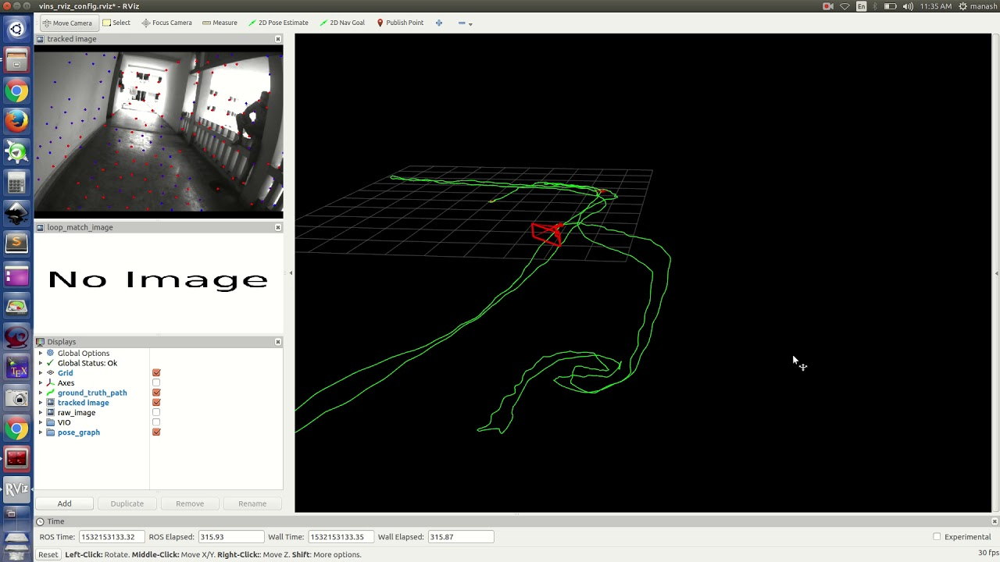
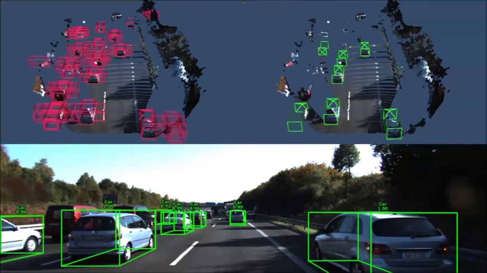

<!-- Main -->

<!-- Two -->
<section id="two" class="spotlights">
	<section>
		
		

			

				<header class="major">
					<h3>VINS-MONO SLAM</h3>
				</header>
				
Worked on visual and visual-inertial SLAM for navigation and localization of self-driving vehicle [VINS Mono]

			

		

	</section>
	<section>
		
		

			

				<header class="major">
					<h3>3d Object Detection/ Segmentation</h3>
				</header>
				
Working on object detection and segmentation implemented with pointnet/pointnet++ algorithms with LIDAR pointcloud data

			

		

	</section>
</section>

