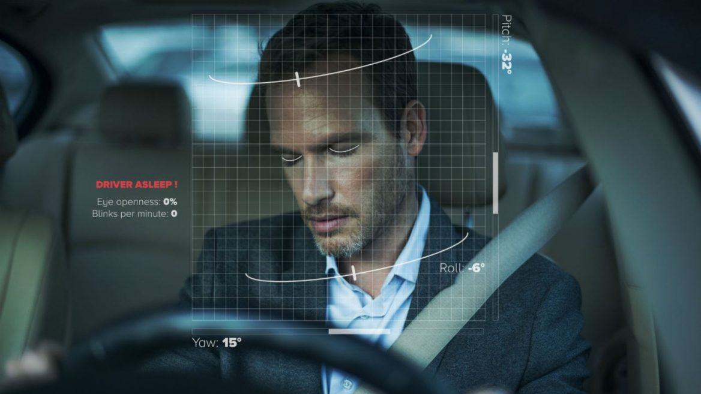
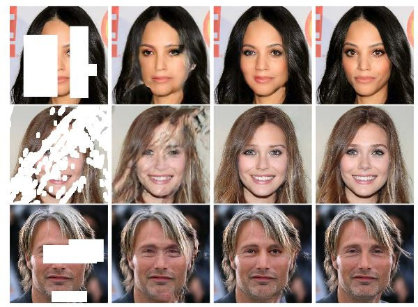

<!-- Main -->

<!-- One -->

<!-- Two -->
<section id="two" class="spotlights">
	<section>
		
		

			

				<header class="major">
					<h3>Expense Tracking App With Receipt Parsing(Jul '20)</h3>
				</header>
				
A simple expense tracking app using MERN stack integrated with receipt parsing using OCR.

				<ul class="actions">
					<li><a href="expensetrack.html" class="button">Learn more</a></li>
				</ul>
			

		

	</section>
	<section>
		
		

			

				<header class="major">
					<h3>Realtime Weapon Detection(Jun '20/ Jul '20)</h3>
				</header>
				
A custom object detection model trained with YOLOV3 to detect weapons from realtime video feeds. Also a REST API for the same to be access from other products/ software. 

				<ul class="actions">
					<li><a href="weapon.html" class="button">Learn more</a></li>
				</ul>
			

		

	</section>
	<section>
		
		

			

				<header class="major">
					<h3>Realtime Driver Drowsiness Detection and Sound Alarm (Jun '20)</h3>
				</header>
				
A machine vision system based on OpenCV to detect the drowsiness status of the driver and alert them with a sound alarm when it goes below a threshold

				<ul class="actions">
					<li><a href="drowsiness.html" class="button">Learn more</a></li>
				</ul>
			

		

	</section>
	<section>
		
		

			

				<header class="major">
					<h3>Image Restoration(Inpainting) using DCGAN (Apr '20)</h3>
				</header>
				
Incomplete patches in any facial portrait images where autocompleted in a plausible manner using trained Generative Adverserial Networks

				<ul class="actions">
					<li><a href="inpainting.html" class="button">Learn more</a></li>
				</ul>
			

		

	</section>
	<section>
		
		

			

				<header class="major">
					<h3>Road Sign Recognition Using LeNet-5 (Apr '20)</h3>
				</header>
				
Road signs found on streets were recognized and classified using deep learning models.

				<ul class="actions">
					<li><a href="roadsign.html" class="button">Learn more</a></li>
				</ul>
			

		

	</section>
	<section>
		
		

			

				<header class="major">
					<h3>Face detection using Viola Jones algorithm (Mar '20)</h3>
				</header>
				
Face detection algorithm performed using Haar classifiers and the performance enhanced using Adaboost algorithm

				<ul class="actions">
					<li><a href="viola.html" class="button">Learn more</a></li>
				</ul>
			

		

	</section>	
	<section>
		
		

			

				<header class="major">
					<h3>Leaf Wilt classification in soy plant using VGG16 (Feb '20)</h3>
				</header>
				
The various stages of tugor loss or in simple terms leaf wilting, in soy plants was classified using neural netoworks. This project was part of a realtime research work.

				<ul class="actions">
					<li><a href="leafwilt.html" class="button">Learn more</a></li>
				</ul>
			

		

	</section>	
	<section>
    	
    	

    		

    			<header class="major">
    				<h3>Face Classification Using Generative Models and EM Maximization (Feb '20)</h3>
    			</header>
    			
Face and Non-Face classification was done using generative models like Gaussian, Mixture of Gaussian, T Model and Factor Analysis and performance improved using EM Maximization algorithm

    			<ul class="actions">
    				<li><a href="emmax.html" class="button">Learn more</a></li>
    			</ul>
    		

    	

    </section>	
	<section>
    	
    	

    		

    			<header class="major">
    				<h3>SIFT Keypoint Detection Using Laplacian Blobs (Dec '19)</h3>
    			</header>
    			
SIFT keypoint feature extraction was done using Laplacian BLobs in python

    			<ul class="actions">
    				<li><a href="sift.html" class="button">Learn more</a></li>
    			</ul>
    		

    	

    </section>	
	<section>
    	
    	

    		

    			<header class="major">
    				<h3>Face Blending(Image Blending) using Pyramid Blending Algorithm (Dec '19)</h3>
    			</header>
    			
Face portraits that were pre-aligned were merged/blended using pyramid blending algoirthm using OpenCV

    			<ul class="actions">
    				<li><a href="blending.html" class="button">Learn more</a></li>
    			</ul>
    		

    	

    </section>	
	<section>
    	
    	

    		

    			<header class="major">
    				<h3>Shortest Route Approximator Between Two Cities In North Carolina (Nov '19)</h3>
    			</header>
    			
Shortest route between two cities(pixels) in a North Carolina map image was estimated using A* algorithm

    			<ul class="actions">
    				<li><a href="shortestroute.html" class="button">Learn more</a></li>
    			</ul>
    		

    	

    </section>
	<section>
    	
    	

    		

    			<header class="major">
    				<h3>Expertiza(Open Source Project)-Automated Mentor Assignment (Apr '20)</h3>
    			</header>
    			
Expertiza is a web application through which students can submit their assignments and peer-review learning objects. This feature was developed to assign mentors automatically to a team that has reached its team limit for a project

    			<ul class="actions">
    				<li><a href="expertiza.html" class="button">Learn more</a></li>
    			</ul>
    		

    	

    </section>	
	<section>
    	
    	

    		

    			<header class="major">
    				<h3>E-Commerce Website using Ruby on Rails (Feb '20)</h3>
    			</header>
    			
An E-Commerce grocery website developed using Ruby on Rails

    			<ul class="actions">
    				<li><a href="ecommerce.html" class="button">Learn more</a></li>
    			</ul>
    		

    	

    </section>
	<section>
    	
    	

    		

    			<header class="major">
    				<h3>Rubik's Cube Solver Bot (Jan '15)</h3>
    			</header>
    			
A fully autonomous DIY rubik's cube bot built using arduino and OpenCV

    			<ul class="actions">
    				<li><a href="rubiks.html" class="button">Learn more</a></li>
    			</ul>
    		

    	

    </section>	
	<section>
    	
    	

    		

    			<header class="major">
    				<h3>Finger Detection And Count Estimation For Hand Cricket Bot (Mar '15) </h3>
    			</header>
    			
Hand/ fingers were detected and number of fingers were estimamted to interface/interact with a hand bot to play hand cricket.

    			<ul class="actions">
    				<li><a href="hand.html" class="button">Learn more</a></li>
    			</ul>
    		

    	

    </section>	
	<section>
    	
    	

    		

    			<header class="major">
    				<h3>Chest Discomfort Aid (Mar '16)</h3>
    			</header>
    			
A remote and efficient ECG circuit was designed to transmit the signals directly to a nearby doctor through an app.

    			<ul class="actions">
    				<li><a href="chestdiscomfort.html" class="button">Learn more</a></li>
    			</ul>
    		

    	

    </section>											    				
</section>

